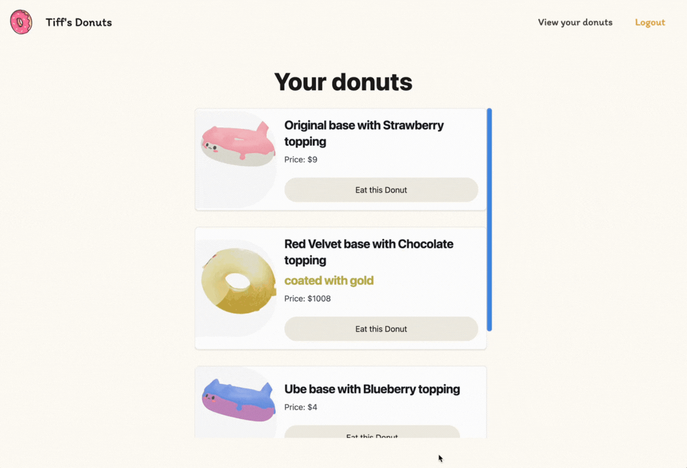

# Tiff's Donuts 🍩

### Welcome to Tiff's Donuts, where creativity meets sweetness!

Tiff's Donuts is a delightful project that lets you design and customize your own adorable donuts.
Whether you're a donut enthusiast or just looking for a fun and creative way to pass the time, this project has got you covered.

## Technologies

     
    

## Visit the website

The project is hosted on Amazon EC2: [Click here and play!](http://ec2-3-27-201-205.ap-southeast-2.compute.amazonaws.com/)

Feel free to login to save and view the donuts that you've created and then eat them up!

## Tools Used

-   ThreeJS / React Three Fiber / Drei
-   Authentication- AWS Amplify Cognito
-   TailwindCSS
-   React (Vite)
-   React Router
-   SuperAgent
-   Vitest
-   PlayWright

## Run the app

1. Clone this repository
2. Install dependencies `npm i`
3. Run migrations & seeds `npm run knex migrate:latest; npm run knex seed:run`
4. Play! `npm run dev`

## Credits

-   <a href='https://sketchfab.com/3d-models/donut-cat-3800caad4695418f9f60bfca87a85304'>Donut Cat</a> by <a href='https://sketchfab.com/Cresis'>Cresis</a>
